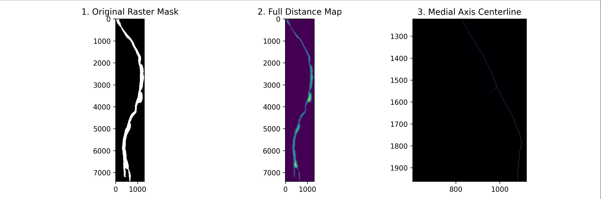

# Fixed-Wing UAV Path Planning for River Survey Corridors

Coverage path planning for a fixed-wing survey UAV flying curvilinear river corridors. Standard lawnmower survey patterns are designed for rectangular areas and waste flight time on long, winding, narrow corridors. This project extracts the corridor geometry from publicly available GIS data and plans a flyable path that follows the river's centerline while respecting the aircraft's minimum turn radius.


## Approach

1. Load river polygons from GeoJSON (OpenStreetMap) and reproject to UTM zone 16N (EPSG:26916) so the geometry is in meters.
2. Rasterize the corridor to a binary mask.
3. Extract a medial-axis centerline and a distance transform giving corridor width at each point along it.
4. Fit a smooth reference path to the centerline.
5. Plan a Dubins-path coverage route constrained by the aircraft's minimum turn radius, with camera footprint and sidelap setting pass spacing.
6. Time-parameterize the planned path into a reference trajectory and simulate a vehicle flying it with a path-following guidance law, measuring cross-track error.


## Vehicle model

Parameters follow a **senseFly eBee X** with an **Aeria X** camera:

| Parameter | Value |
| --- | --- |
| Cruise speed | 15 m/s |
| Min. Turn Radius | 39.7 m |
| Max Bank Angle | 30 deg |
| Altitude AGL | 120 m |
| Camera FOV | 56 deg |
| Sidelap | 25% |

Minimum turn radius is derived from the cruise speed and bank angle limit.

## Files

| File | Purpose |
| --- | --- |
| `geotester.py` | Loads GeoJSON, reprojects to EPSG:26916, merges to a single polygon |
| `sine_river.py` | Generates synthetic sinusoidal river corridors for testing |
| `rasterize.py` | Converts the corridor polygon to a raster mask |
| `main.py` | Medial-axis centerline extraction and distance transform |
| `eBeeX.py` | Vehicle and camera parameters, turn-radius calculation |
| `SplineFit.py` | Centerline smoothing (in progress) |

## Status

**Working:** GIS ingestion, reprojection, rasterization, centerline extraction, distance transform, vehicle parameter model.

**In progress:** spline fitting of the centerline, Dubins-path coverage planner, closed-loop tracking simulation and evaluation against a lawnmower baseline.

**Out of scope:** wind modeling, physical flight testing. Evaluation is in simulation only.

## Requirements

Python 3.10+, with:

```
geopandas==1.1.4
matplotlib==3.11.1
numpy==2.5.2
rasterio==1.5.1
Shapely==2.1.2
skimage==0.0
```

## Usage

```bash
python main.py
```