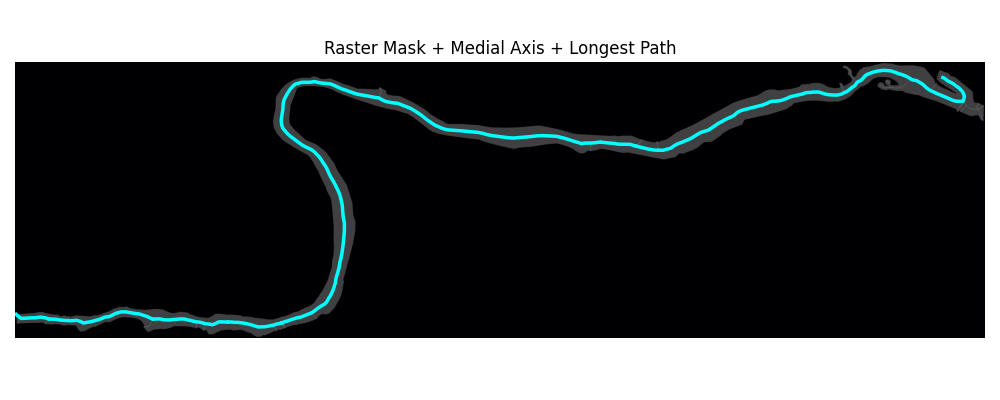

# Fixed-Wing UAV Path Planning for River Survey Corridors

Coverage path planning for a fixed-wing survey UAV flying curvilinear river corridors. Standard lawnmower survey patterns are designed for rectangular areas and waste flight time on long, winding, narrow corridors. This project extracts the corridor geometry from publicly available GIS data and plans a flyable path that follows the river's centerline while respecting the aircraft's minimum turn radius.

## Approach

1. Load river polygons from GeoJSON (OpenStreetMap) and reproject to UTM zone 16N (EPSG:26916) so the geometry is in meters.
2. Rasterize the corridor to a binary mask.
3. Extract a medial-axis centerline and a distance transform giving corridor width at each point along it.
4. Fit a smooth reference path to the centerline.
5. Plan a Dubins-path coverage route constrained by the aircraft's minimum turn radius, with camera footprint and sidelap setting pass spacing.
6. Evaluate coverage percentage and path length against a fixed-width lawnmower baseline flown over the same corridor.
7. *(planned)* Time-parameterize the planned path into a reference trajectory and simulate a vehicle flying it with a path-following guidance law, measuring cross-track error.


*Raster mask, distance heatmap, and MAT centerline of a fox river segment*



*True centerline of the river overlaid on the raster mask*

## Vehicle model

Parameters follow a **senseFly eBee X** with an **Aeria X** camera:

| Parameter | Value |
| --- | --- |
| Cruise speed | 15 m/s |
| Min. Turn Radius | 39.7 m |
| Max Bank Angle | 30 deg |
| Altitude AGL | 120 m |
| Camera FOV | 56 deg |
| Sidelap | 60% |

Minimum turn radius is derived from the cruise speed and bank angle limit.

## Results

The planner was evaluated on a Fox River corridor against a conventional
boustrophedon (lawnmower) coverage pattern. Both planners use the same
vehicle model, camera footprint, minimum turn radius, and Dubins connections
between passes.

| Metric | Boustrophedon | Proposed |
|---|---:|---:|
| Flight distance | 189.8 km | 16.2 km |
| Coverage | 100% | 94.3% |
| Minimum turn radius | 39.7 m | 39.7 m |

The proposed planner reduced planned flight distance by approximately 91.5%
while maintaining approximately 94% corridor coverage.

## Files

| File | Purpose |
| --- | --- |
| `preprocessor.py` | Loads GeoJSON, reprojects to EPSG:26916, merges to a single polygon |
| `sine_river.py` | Generates synthetic sinusoidal river corridors for testing |
| `rasterize.py` | Converts the corridor polygon to a raster mask |
| `find_longest_path.py` | Finds longest path along the skeleton |
| `spline_tools.py` | Fits, offsets, and joins splines into a single flight path via a Dubins connector |
| `evaluator.py` | Width/coverage evaluation metrics, plus the full raster-to-flight-path pipeline (`test_river`) |
| `lawnmower.py` | Generates a fixed-width lawnmower baseline path for comparison |
| `plot_path.py` | Plots a flight path over the river corridor |
| `dubins_path.py` | Dubins path computation (not original work) |
| `e_bee_x.py` | Vehicle and camera parameters, turn-radius calculation |
| `main.py` | Runs the lawnmower baseline and spline-offset path, compares coverage/length, and plots both |

## Status

**Working:** GIS ingestion, reprojection, rasterization, centerline extraction, distance transform, vehicle parameter model, centerline smoothing, spline fitting, spline offsets, Dubins path connection between passes, fixed-width lawnmower baseline generation, coverage/path-length evaluation, and comparison plotting between the lawnmower and spline-offset paths.

**Known limitation:** offset passes can locally exceed the aircraft's minimum turn radius in tight bends, since a constant offset distance tightens the effective radius on the inside of a curve. Curvature-aware (variable-width) offsetting is planned as the principled fix.

**In progress:** Spline offset overlap handling; closed-loop tracking simulation with a path-following guidance law.

**Out of scope:** wind modeling, physical flight testing. Evaluation is in simulation only.

## Requirements

Python 3.13+, with:
geopandas==1.1.4
matplotlib==3.10.6
numpy==2.2.6
rasterio==1.5.1
scikit-image==0.26.0
scipy==1.16.1
shapely==2.1.2

## Usage

```bash
python main.py
```